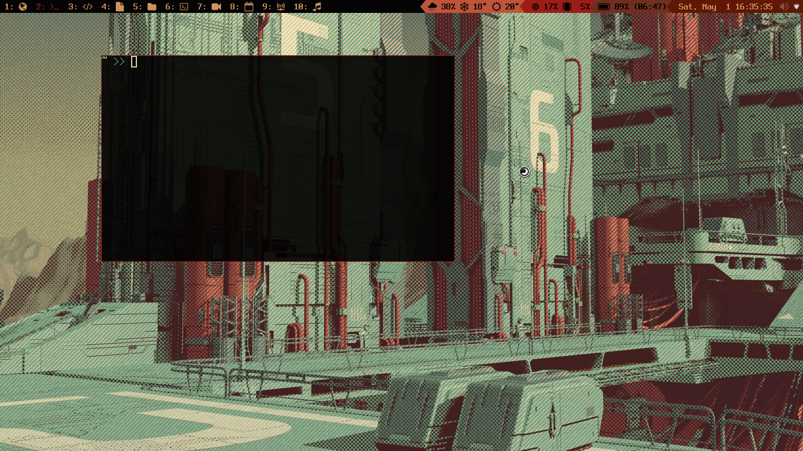

Notes
- Place the .xinitrc file in your home folder and comment/uncomment lines for different configs (this is read when you run "startx" from a tty - you will need to install xorg-xinit)
- To use the i3blocks scripts and other shell scripts, you will need to "chmod +x" them each individually

Some useful apps
- volumeicon (the volume app in system tray)
- maim + xdotool (screenshots)
- nitrogen or feh for setting background
- redshift-gtk (blue light filter)
- blueman-applet (bluetooth, read the arch wiki to make it work for audio)
- pcmanfm (file browser)
- rhythmbox (music player)
- lxappearance (for setting gtk theme, place the themes in "~/.themes")
- alacritty (terminal)

- spotify-tui
- todo.txt
- pandoc (document converter)

Fonts
- Terminus
- Nerd fonts (icons)

Other fonts
- noto-fonts, noto-fonts-extra, noto-fonts-emoji, noto-fonts-cjk (will cover pretty much any font you might come across online)
- Share Tech Mono
- Font Awesome (icons)

Connect to Wifi in installer
https://www.youtube.com/watch?v=3zqITuprlL8
